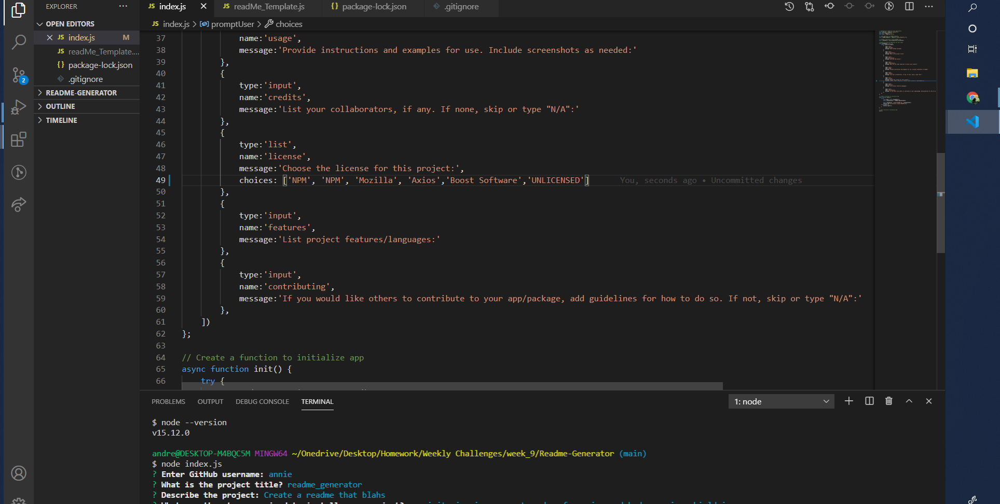

# Readme-Generator

## Description 
    readme generator for user ease
    
 ## Table of Contents
 - [Description](#description)
 - [Installation](#installation)
 - [Usage](#usage)
 - [Credits](#credits)
 - [License](#license)
 - [Badges](#badges)
 - [Features](#features)
 - [Contributing](#contributing)
## Installation
      NPM, Node installation, then run node index.js
 ## Usage
 
    
 ## Credits
      myself and github, youtube vids, freecodecamp and Microsoft  
## License
      This application is covered by NPM license.
## Badges
    This Application uses Shield.io for Badges
## Features
      Javscript, Node.js, some ES6 and Express
## Contributing
      no please
  
